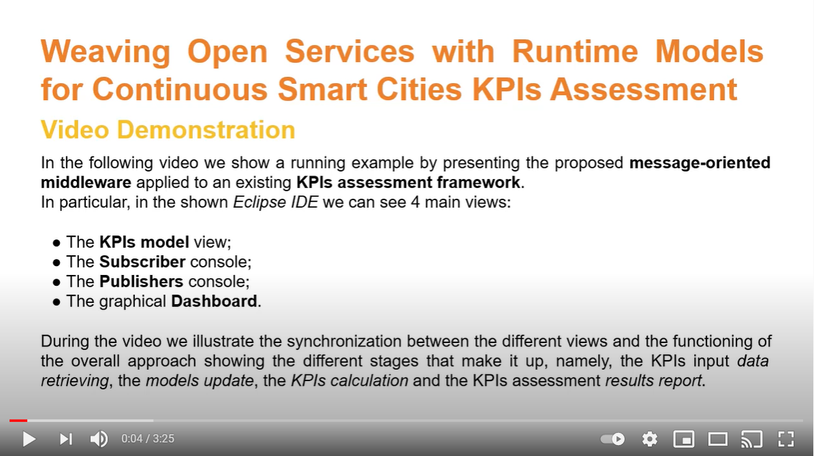

# Weaving Open Services with Runtime Models for Continuous Smart Cities KPIs Assessment
This work presents a **service-oriented middleware** that connects *open services* and *runtime models*. Specifically, through this middleware, open services can be used to support the evolution of runtime models, by continuously and automatically feeding them with the data they require. 

To demonstrate the feasibility of our solution, we applied it to the work presented in \[1\] \[2\] presenting a model-based Key Performance Indicators (KPIs) assessment framework for smart cities that allows:
- the definition of a [smart city](smartcity.png) in a processable way also through the exploitation of graphical editors; 
- the definition/selection of the [KPIs](mykpi.kpis) of interest for the smart city under evaluation through the exploitation of textual DSLs; 
- the evaluation of the selected KPIs on the subject smart city.

The message-oriented middleware, once applied to the work in \[1\] \[2\], enables the continuous monitoring of KPIs input parameters provided by open services, thus automating the data acquisition process and the update of the model describing the smart city under evaluation. 

In the video embedded in the figure that you can find at the bottom of this page, we show the functioning of the overall approach together with the new continuous monitoring features by showing the different stages that make it up:
- the KPIs input data retrieving from open services, e.g., open data APIs, IoT sensors (we used the [Tinkerforge Air Quality device](board.png) - the other components are detached since we do not use them in this scenario);
- the update of the model describing the smart city under evaluation;
- the KPIs calculation;
- the KPIs assessment results report.

\[1\] M. De Sanctis, L. Iovino, M. T. Rossi, and M. Wimmer, “A flexible architecture for key per-formance indicators assessment in smart cities,” in Proc. of the European Conf. on Software Architecture (ECSA). Springer, 2020, pp. 118–135.

\[2\] M. De Sanctis, L. Iovino, M. T. Rossi, and M. Wimmer, “MIKADO – A Smart City KPIs Assessment Modeling Framework” Software & Systems Modeling, 2021.

