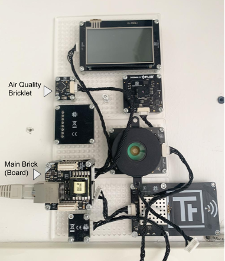

# Runtime Models Injection for Continuous Key Performance Indicators Assessment
The presented work is collocated in the context of a project devoted to the Key Performance Indicators (KPIs) assessment over smart cities by means of Model-driven Engineering techniques.
In particular, the approach allows: 
- the definition of a [smart city](smartcity.png) in a processable way also through the exploitation of graphical editors; 
- the definition/selection of the [KPIs](mykpi.kpis) of interest for the smart city under evaluation through the exploitation of textual DSLs; 
- the evaluation of the selected KPIs on the subject smart city.

This work presents a service-oriented extension of the model-based KPIs assessment framework for smart cities enabling continuous monitoring of KPIs input parameters provided by open services, in order to automate the data acquisition process and the update of the model describing the smart city under evaluation. 

In the video embedded in the figure that you can find at the bottom of the page, we show the functioning of the overall approach together with the new continuous monitoring features by showing the different stages that make it up:
- the KPIs input data retrieving from open services, e.g., IoT sensors (we used the Tinkerforge Air Quality device in the figure (the other components are detached since we do not use them in this scenario)), open data APIs;

- the update of the model describing the smart city under evaluation;
- the KPIs calculation;
- the KPIs assessment results report.

