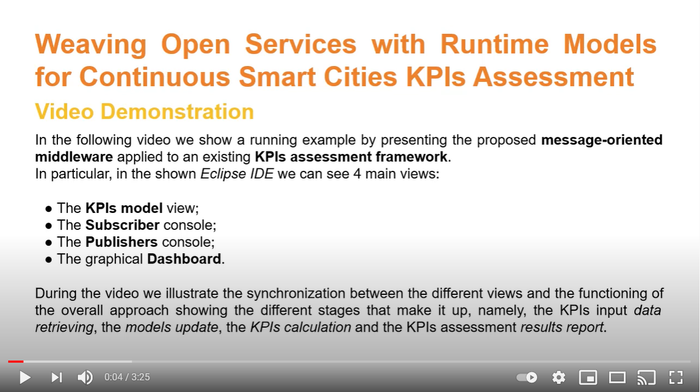
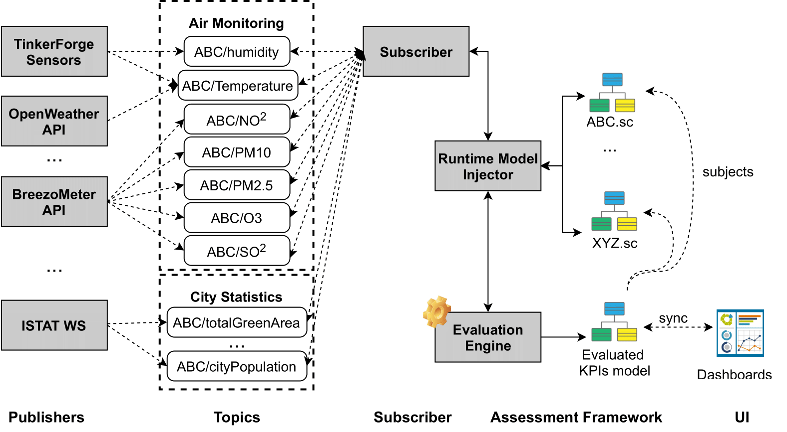

# Weaving Open Services with Runtime Models for Continuous Smart Cities KPIs Assessment
This work presents a **service-oriented middleware** that connects *open services* and *runtime models*. Specifically, through this middleware, open services can be used to support the evolution of runtime models, by continuously and automatically feeding them with the data they require. 

To demonstrate the feasibility of our solution, we applied it to the work presented in \[1\] \[2\] presenting a model-based Key Performance Indicators (KPIs) assessment framework for smart cities that allows:
- the definition of a [smart city](smartcity.png) in a processable way also through the exploitation of graphical editors; 
- the definition/selection of the [KPIs](mykpi.kpis) of interest for the smart city under evaluation through the exploitation of textual DSLs; 
- the evaluation of the selected KPIs on the subject smart city.

The message-oriented middleware, once applied to the work in \[1\] \[2\], enables the continuous monitoring of KPIs input parameters provided by open services, thus automating the data acquisition process and the update of the model describing the smart city under evaluation. 

In the video embedded in the figure that you can find at the bottom of this page, we show the functioning of the overall approach together with the new continuous monitoring features by showing the different stages that make it up:
- the KPIs input data retrieving from open services, e.g., open data APIs, IoT sensors (we used the [Tinkerforge Air Quality device](board.png) - the other components are detached since we do not use them in this scenario);
- the update of the model describing the smart city under evaluation;
- the KPIs calculation;
- the KPIs assessment results report.

\[1\] M. De Sanctis, L. Iovino, M. T. Rossi, and M. Wimmer, *“A flexible architecture for key per-formance indicators assessment in smart cities”* in Proc. of the European Conf. on Software Architecture (ECSA). Springer, 2020, pp. 118–135.

\[2\] M. De Sanctis, L. Iovino, M. T. Rossi, and M. Wimmer, *“MIKADO – A Smart City KPIs Assessment Modeling Framework”* Software & Systems Modeling, 2021.

# Prototype at Work
In the Figure below is shown a running example of our approach.

We applied the extended evaluation framework over a real smart city, i.e., *L'Aquila*.
However, the framework can evaluate multiple SCs at a time.
As dynamic KPIs we consider: *Humidity*, i.e., the percentage of the detected humidity level, *Air Pollution*, 
*PM2.5*, *NO2*,
measuring the PM2.5 and NO2 pollutants levels in the air, *Urban Heat Island (UHI)*, i.e., the difference in air temperature between the city and its surroundings (provided by two different sources), and *Green Area (GA)* as a less dynamic KPI measuring the green area hectares per 100.000 inhabitants. 

Four Publishers are considered as data sources for the input parameters of these KPIs.
[BreezoMeter](https://www.breezometer.com/) is a website offering **open API** exposing environmental data and insights to third party applications. 
It can be queried via a specific *url* taking the latitude and longitude of a city as parameters, and it replies with JSON data providing values for different pollutants and other interesting info. 

[ISTAT](http://dati.istat.it) is the national statistics institute providing **Web services** exposing statistics about, e.g., the census of population, economic censuses. 

[OpenWeather map](https://openweathermap.org) provides information about weather forecasts, air temperature, etc. for any coordinates via an open API. 

Lastly, an IoT infrastructure based on [Tinkerforge](https://www.tinkerforge.com/en/) sensors that publishes data from a Tinkerforge Air Quality [Bricklet](https://bit.ly/3xngllU).  Tinkerforge is a system of building blocks, based on pluggable modules and APIs, available for many programming languages. Using this board we have assembled a smart environment sensor in our department measuring multiple air quality parameters, e.g., humidity and temperature (a picture of the assembled board is available at this [link](https://bit.ly/3fv8DQB) ). 

The first three publishers collect different parameters values (e.g., PM2.5, totalGreenArea) through APIs calls and create topics for all of them. Anytime these values change, the publishers will send a new MQTT message. The Tinkerforge publisher, instead, continuously monitors specific parameters, i.e., humidity and temperature, for which a new message is published when the measured values change. 
